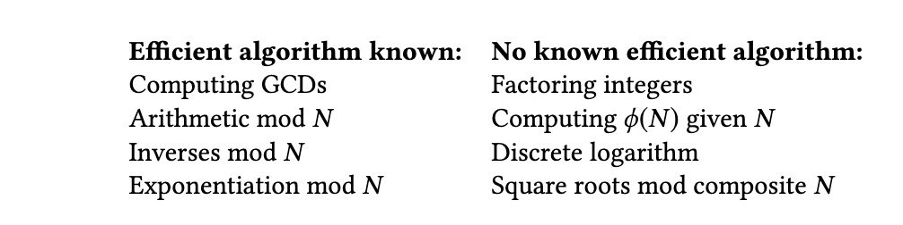
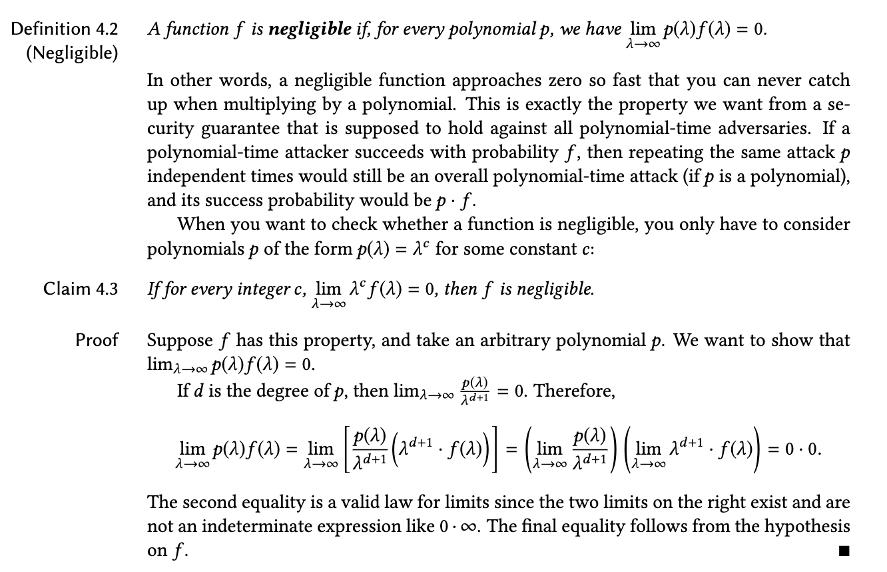
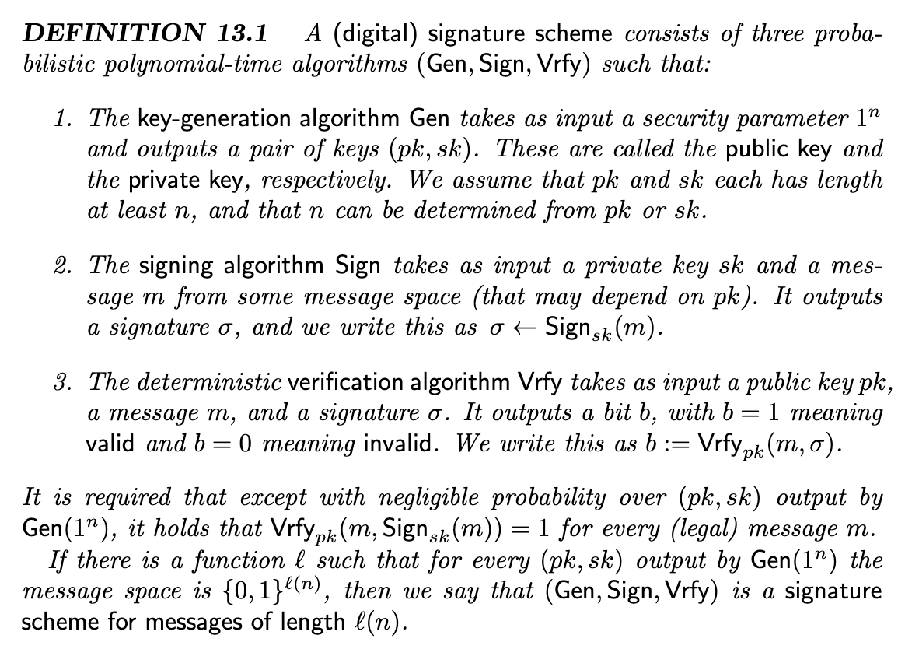
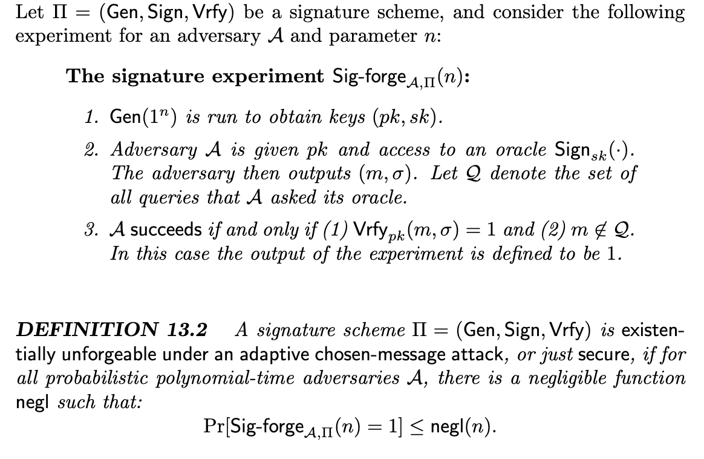
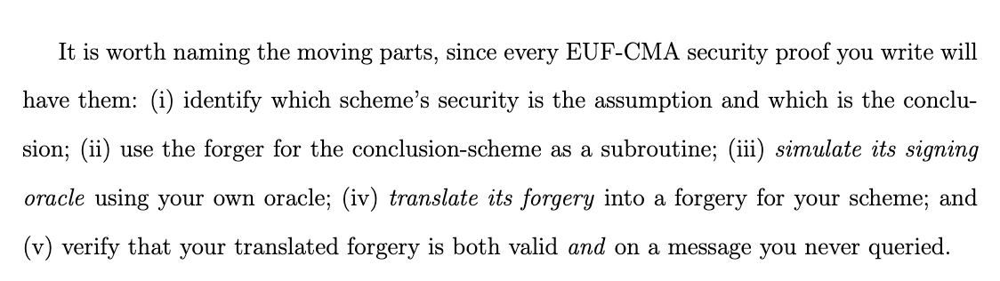

# Computational Hardness

For most of the hard problems in out cryptographic schemes, we don't have any proof that they are actually infeasible to be broken. We mostly just reason about the fact that the best algorithm we know of makes it computationally infeasible for that scheme to be broken.
If we want to look at it more mathematically, it would be looking at algorithms that have either polynomial e.g. ($ax^n + bx^{n-1}+ \cdots$ ) runtime in comparison to the ones that have polynomial runtime.

    In the context of cryptography, our goal will be to ensure that no polynomial-time attack can successfully break security. We will not worry about attacks like brute-force that require exponential time.

It's worth to note that other than the runtime of an algorithm we also need to take into account the success probability it has when breaking the system.

        We don’t want to worry about attacks that are as expensive as a brute-force attack, and we don’t want to worry about attacks whose success probability is as low as a blind-guess
attack.

## Negligible Functions

The intuition behind a negligible probability function is:

    Indeed, 1/2λ approaches zero so fast that no polynomial can “rescue” it; or, in other words, it approaches zero faster than 1 over any polynomial.

## Digital Signature Schemes

An overall definition of digital signature schemes can be found below:

Although this defines the signature scheme, it's not a formal definition of it's security. we can see two different security definitions below:

### Questions

- When does the message space depend on the public key in a signature scheme?

- Not sure if it's just me, but it seems a bit confusing the difference between the terms "game" and "experiment". What is the difference?

#### Difference Between Game and Experiment

1. Game describes the rules of interaction between the **challenger** and the **adversary**.

It specifies:

* what information the adversary receives,
* what queries they may make (e.g., encryption or decryption oracles),
* what secret values are generated,
* what the adversary must output to win.

Think of it as the **protocol of the security test**.

2. Experiment (running the game)

An **experiment** is a **single execution of the game**, where all randomness is instantiated.

This includes:

* the random key generation,
* the challenger's random choices,
* the adversary's random coins.

Since everything is randomized, each execution may produce a different outcome.

Mathematically, you often see notation like

$$
\text{Exp}^{\text{IND-CPA}}_{A,\Pi}(1^\lambda)
$$

which means:

> "Run the IND-CPA game for scheme (\Pi) against adversary (A)."

The output is typically just:

* 1 if the adversary wins,
* 0 otherwise.

The security definition is then expressed as

$$
\Pr[\text{Exp}^{\text{IND-CPA}}_{A,\Pi}(1^\lambda)=1].
$$

So:

* **game** = the rules,
* **experiment** = one randomized execution of those rules.

Suppose we're proving IND-CPA security.

* **Game:** Defines the challenger, encryption oracle, challenge ciphertext, and winning condition.
* **Attack:** The adversary's algorithm that tries to distinguish the challenge ciphertext.
* **Experiment:** One randomized execution of the game using that particular adversary.

3. Why the terminology sometimes overlaps

Many papers use **game** and **experiment** almost interchangeably. For example, you'll see phrases like:

* "Consider the following security game..."
* "Define the experiment $\mathrm{Exp}()$..."

Both often refer to the same formal object. The subtle distinction is that the **game** is the specification of the interaction, while the **experiment** is the randomized execution of that specification. In contrast, an **attack** always refers specifically to the adversary's strategy within the game.

## EUF-CMA Security

A systematic way to prove EUF-CMA security with reduction

