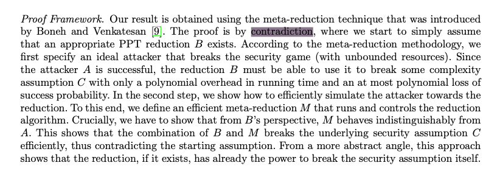
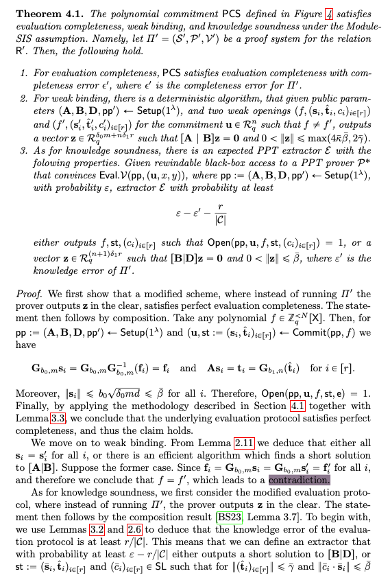

# Proofs

## Notes

### State-less Proofs

The first unit of the course is about mathematical proofs, in general and not specifically proofs in cryptography. It is still nice to read it since cryptographic proof, no matter how much it doesn't look like it, still use these proof technique at core.
The techniques we've seen so far are:

- Proving existence:
    Just to show even one example is proof enough for the theorem to be proven.
- Proving universality:
    This is not the same, we want to universally prove a theorem for all members of a set, just one example does not prove it in general.
- Proof of an implication ( if $P$ then $Q$ ):
    this can be proven in two ways, either we directly prove $P$ implies $Q$ or we just show that $\bar{Q}$ implies $\bar{P}$ which is the same.
- Proof of contradiction:
    If we assume that the theorem to be proven is not correct, we will get to an impossible situation, a statement being both true and false. This results in a contradiction meaning our assumption at the start was false hence the theorem is correct.
- Proof by induction:
    Proof by induction, from what I understood, induces one statement from another till you get to a general case (I genuinely refer you to the example in [second lecture note](./lecture-notes/mit6_1200j_s24_lec02.pdf)).

### State Machines

## Questions

- How are these applied in cryptography?

    Some of them don't necessarily have a direct example in cryptographic papers, but I thought it could be nice to see some recent papers using the methods(and to also start reading cryptographic proofs).

    - By contradiction in [New Limits of Provable Security and Applications to ElGamal Encryption](https://eprint.iacr.org/2024/795.pdf)
    
    - By contradiction in [Greyhound: Fast Polynomial Commitments from Lattices](https://eprint.iacr.org/2024/1293.pdf)
    

## Summary

## Extra Reading

## Resources
